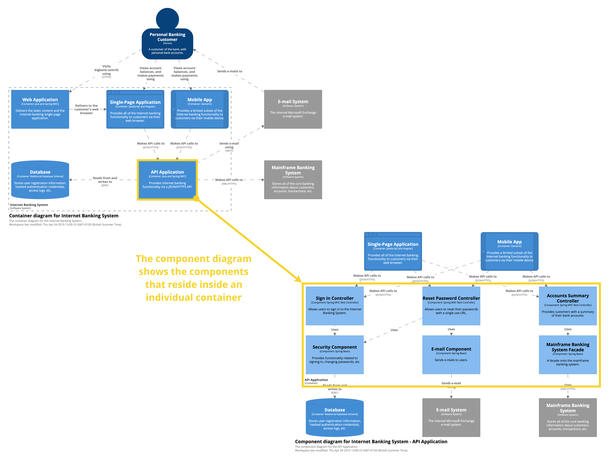

## Level 1: Software systems
- A software system is the highest level of abstraction, representing something that delivers
value to its users, whether they are human or not.

## Level 2: Containers
- Put simply, a container represents something that hosts code or data, like an application or a
data store. A container is something that needs to be running in order for the overall software
system to work.
- A container is essentially a context or boundary inside which some code is executed or some
data is stored
- Containers are separately deployable
- The implication here is that communication between containers is likely to require an out-of-process or remote
procedure call across the process and/or network boundary.
## Level 3: Components
- a component is a grouping of related functionality encapsulated behind a well-defined interface
- With the C4 model, components are not separately deployable units. Instead, it’s the container that’s the deployable unit.

## Level 4: Code
- components are made up of one or more code elements constructed with the basic
building blocks of the programming language that you’re using; classes, interfaces, enums,
functions, objects, etc.

# Process

- In essence, we’re grouping the classes and interfaces into components, which is a unit of
related functionality
- Example: complex codebase layerd into - system, container (the web application itself), component (important services / classes etc)

## Microservices
### Microservices as software systems
If your software system has a dependency upon a number of microservices that are outside
of your control (e.g. they are owned and/or operated by a separate team), I would treat these
microservices as external software systems that you can’t see inside of. 
### Microservices as containers
On the other hand, if the microservices are a part of a software system that you are building
(i.e. you own them), I would treat them as containers, along with any data stores that those
microservices use (these are separate containers).

Other:
- Serverless - I tend to treat the serverless concepts (e.g. Amazon Lambdas, Azure Functions) in the
same way as microservices, think of them as containers

# C4 model
1. System Context - A System Context diagram provides a starting point, showing how
the software system in scope fits into the world around it.
2. **Containers**: A Container diagram zooms into the software system in scope, showing
the high-level technical building blocks (containers) and how they interact.
3. **Components**: A Component diagram zooms into an individual container, showing the
components inside it.
4. **Code**: A code (e.g. UML class) diagram can be used to zoom into an individual
component, showing how that component is implemented.
Example:

# Sheidermans mantra
Overview first, zoom and filter, then details-on-demand

The author follows this mantra to create diagrams -> overview, zoom more and then details on demand

# Various notes
- C4 model is not a description of a design process,
- Authors recommendation is that all teams create System Context and Container diagrams, and really
think about whether Component and Code diagrams provide enough benefit considering the
cost of creating and keeping them up to date.

# 6. Level 1: System Context diagram
A System Context diagram can be a useful starting point for diagramming and documenting
a software system, allowing you to step back and look at the big picture.   
## Structure
Draw a block diagram showing your software system as a box in the centre, surrounded
by its users and the other software systems that it interacts with. Detail isn’t important
here as this is your zoomed-out view showing a big picture of the software system and the
immediate world around it. The focus should be on people (actors, roles, personas, etc) and
software systems rather than technologies, protocols and other low-level details. It’s the sort
of diagram that you could show to non-technical people.
Example:

## Elements:
- people
  - Name: The name of the person, user, role, actor or persona. 
  - Description: A short description of the person, their role, responsibilities, etc
- Software systems
  - Name: The name of the software system. 
  - Description: A short description of the software system, its responsibilities, etc.
- Enterprise boundary
  - Optionally, I may want to capture some information about the location of people and/or
software systems relative to my point of reference. If I’m building a software system inside
an organisational/enterprise boundary, that software system may interact with people and
software systems outside that boundary. In this slightly modified example, the dashed line
represents the boundary of the bank, and is used to illustrate what’s inside vs what’s outside
of the bank.
  - Example with dashed:
  - 
  - 
## Interactions
  Try to annotate every interaction between elements on the diagram with some information
about the purpose of that interaction. This avoids creating a diagram where a collection of
boxes are somehow connected via a set of ambiguous lines
## Motivation
A System Context diagram doesn’t show much detail but it does help to set the scene, and
is a starting point for other diagrams. I will often draw this diagram during a requirements
gathering workshop, to ensure that everybody understands the scope of what we’ve been
tasked to build. It can be a great requirements gathering and analysis tool.
## Audience
Technical and non-technical people, inside and outside of the immediate software development
team.
## Required or optional?
Required. All software systems should have this

# Level 2: Container diagram
The Container diagram shows the high-level shape of the software architecture and how
responsibilities are distributed across it. It also shows the major technology choices, how
they are used, and how containers communicate with each other. It’s a high-level technology
focussed diagram that is useful for software developers and support/operations staff alike. A
container diagram helps you answer the following questions:
1. What is the overall shape of the software system?
2. What are the high-level technology decisions?
3. How are responsibilities distributed across the system?
4. How do containers communicate with one another?
5. As a developer, where do I need to write code in order to implement features?

Internal banking system example:

NOTE: No physical / clusting info here. Instead, I show physical instances, failover, clustering, etc on a separate Deployment diagram that illustrates the mapping of containers onto
infrastructure.

## detail level
as much as you need. up to you

## elements:
- containers - name / tech / description
- other elements in the diagram:
  - people
  - software systes
This diagram is similar to the system diagram, so you can include all the same things - but you are very zoomed in on one container.

Example:

## Interactions:
- interactions should be annotated instead of just arrows;
  - The purpose of the interaction (e.g. “reads/writes data from”, “sends reports to”, etc). 
  - The communication mechanism (e.g. Web Services, REST, Web API, Java Remote
Method Invocation, Windows Communication Foundation, Java Message Service). 
  - The communication style (e.g. synchronous, asynchronous, batched, two-phase commit,
etc).
  - Protocols and port numbers (e.g. HTTP, HTTPS, SOAP/HTTP, SMTP, FTP, RMI/IIOP,
etc).

## Audience
Technical people inside and outside of the immediate software development team; including
everybody from software developers through to operational and support staff.

## Optional or required?
REquired

# Level 3: Component diagram

FOllows the container diagram, zooms in on a specific component

A Component diagram helps you answer the following questions.
1. What components is each container made up of?
2. Do all components have a home (i.e. reside in a container)?
3. It is clear how the software works at a high-level?
Example:

ELements in the diagram: people, systems, containers and components; If you include those -> create a box around the specific component you are diagraming to include the boundary.

Example:

If you want to illustrate that a particular component is a shared component or sits within a
specific library/module, again, you can use a notation (e.g. a **symbol**/**icon** or **colour** coding)
to represent this fact.

## Audience
Technical people within the software development team.

## Optional or required?
OPtional. If monolith - maybe it makes sense. Hard to keep up to date.

# Level 4: Code-level diagrams
The intent of a code-level diagram is to illustrate the structure of the code and, in this case,
how a component is implemented.

If you’re using an object-oriented programming language, probably the best way to do this
is to use a **UML** class diagram, either by generating it automatically from the code or by
drawing it freehand.
Example:

Dangeer is you may include way too much clutter. Only include the info that is relevant to what you want to tell.
Limit the scope of this diagram to your motivation for creating it.

## Audience
Technical people within the software development team, specifically software developers.

## Required or optional
Optional and not needed in most cases. SWEs can get this detail from the code itself.

# Notation

1. Title - all elements  should have it. Give a title to your diagram as well (system context etc). Title can be numbered if order of looking matters.
2. Add a legend, on how you use the different stuff and what they mean:
   1. shapes
   2. line styles
   3. colors
   4. borders
   5. acronyms
3. Elements: start with boxes first and then you can change the shapes if needed. He uses a simple style. Why? Easy to draw on the whiteboard, sticky notes and index cards:
   1. Person: Name and description. 
   2. Software system: Name and description.
   3. Container: Name, technology and description.
   4. Component: Name, technology and description.
   5. 
4. Description / responsibilties: Naming is very hard! A really simple, yet effective, way to add an additional layer of information to, and remove
ambiguity from, an architecture diagram, is to annotate diagram elements with a short
descriptive statement of what their responsibilities are. A bulleted list (7 +/- 2 items) or a
short sentence works well. Use a smaller font too
5. Colour - great way to differentiate elements. Make sure to include a notation if you are using color
6. Shapes - not necassary but make it aestatically pleasing. He uses just a few different shapes:
   - Boxes (squares, rectangles, rounded boxes, circles, ellipses and hexagons). 
   - People shapes (the “stick man”¹, “head and shoulders”, etc). 
   - Cylinders (e.g. to represent databases). 
   - Folder shapes (e.g. to represent file systems).
7. Borders - label them if used.
8. Size - unless a specific clear reason for it -> make all the same size
9. Lines:
   1. **Directionality** (arrows) - he picks the most significant direction and points there. Draws from initiator to receiver. Additional (bidrectional) info can be added in the description of the pointer.
   2. description - describes relation and ending word explains why the direction is that way (aka api pointing to DB - "reads from and writes **to**"). TO check if the description makes sense, say out loud, starting from starting box and ending from ending box.
      1. Bad:  API "reads and writes" DB
      2. GOod: API "reads from and writes **to**" DB
   3. line style: (have a legend)
      - solid lines - synchronous interactions
      - dashed lines - asynchronous interactions 
      - greed - https connections
      - amber - http connections
   4. Line count: if you need to be precise with the exact connection counts and need multiple descriptions, you can have multiple lines coming out of 1 box and going to the second box.
10. Layout:
    1. if you use a whiteboard, you can use sticky notes / index cards for flexibility;
    2. https://en.wikipedia.org/wiki/Class-responsibility-collaboration_card
11. Orientation: recommends putting the most important things in the center of the diagram
12. Acronyms: avoid when possible or have a glossary in the doc
13. Quality attributes - additonal data - can be added as description but don't try to force everything into a diagram. Lightweight docs are the way to go if you have lots of data that you want to share.
14. Scope - if diagram too big split it into smaller parts by scope domain business use etc.
15. Listen for questions - if something comes up -> make sure to include the answer to the question in the updated documentary / glossary
# Diagrams must reflect reality
1. If you have a logging component on the diagram -> there should be such a compoment in the code (preferably with that name). AKA design your code in such a way that is clear what things do, are htey modules, components etc. Naming conventions of code help here.
2. INclude technology choice info in the diagram

# Deployment Diagrams
C4 for is for static software structure. Deployment diagrams are for actual deployment of the software.
Example of c4 style deployment diagram for internet banking:

Live deployhment example:

# Other diagrams
## System Landscape diagram
Like system context but without a particular focus, broad on the org level
## User interface mockups and wireframes
## Business process and workflow
## Domain model
## Runtime and behaviour    
## Sequence diagrams

## Collaboration diagrams
 
# Anki cards
- Shneidermans mantra / process, flow for actually diagraming systems
- the c4 model itself
- shapes used
- what info to include in the boxes / shapes at each level
- Anki card for this method: https://en.wikipedia.org/wiki/Class-responsibility-collaboration_card
- Sequence diagrams -> add it to anki and get an example